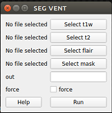
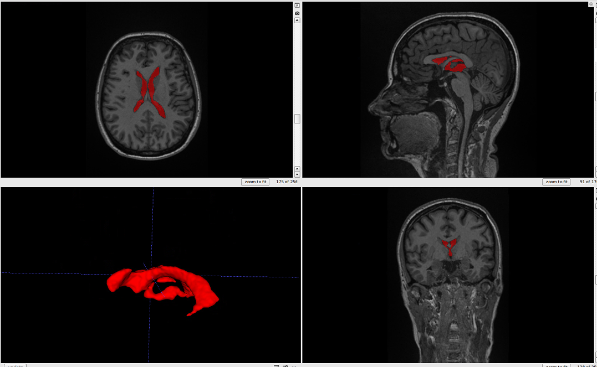

# Segmentation tutorials

## GUI

Watch this video tutorial:

-----

Or follow the steps below:

After opening the VentMapp3r GUI, click "Ventricle" under the "Segmentation" tab. Wait for a new pop-up window to appear. The window should look like the image below.

Click "Select t1w" and chose your T1 image. Click "Run".
Click either or both "Select t2w" and "Select flair" (with respect to the sequences you have) and select the correspending images.
Type your desired output name in the "out" box.
Check the box next to "force" if you want to overwrite a previous output.
Click "Run".
Your output file will automatically appear in your t1w folder.

## Command Line

    ventmapper seg_vent
    
    Optional arguments:
    -h, --help            show this help message and exit
    -s , --subj           input subject
    -fl , --flair         input Flair
    -t1 , --t1w           input T1-weighted
    -t2 , --t2w           input T2-weighted
    -m , --mask           brain mask
    -o , --out            output prediction
    -f, --force           overwrite existing segmentation
    -ss , --session       input session for longitudinal studies
    
    Examples:
    ventmapper seg_vent -s subjectname -b
    ventmapper seg_vent -t1 subject_T1_nu.nii.gz -o subject_vent.nii.gz

The output should look like this.:

